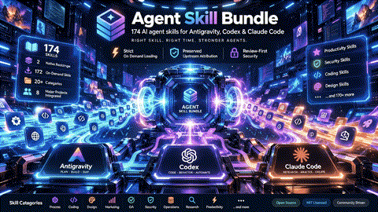
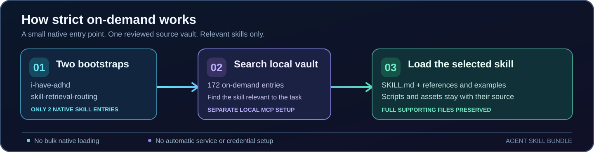

# Agent Skill Bundle



**187 reviewed agent-skill directories. One source vault. Two native bootstrap skills.**

A source-preserving collection of reusable AI agent workflows for **Google Antigravity, OpenAI Codex, Claude Code**, and other file-based Agent Skills hosts. Find the skill you need without loading the entire collection into the agent's native startup discovery.

> Original authors retain credit. Skills, supporting files, license notices, and reviewed source revisions stay traceable. Host adapters are separate from upstream copies.

[Quick start](#quick-start-strict-on-demand) · [What's included](#whats-included) · [External tools](#skills-are-not-software) · [Security](SECURITY.md) · [Upstream credits](CREDITS.md) · [Source review](docs/REVIEW_2026-09-27.md)

## At a glance

| | |
|---|---|
| **187** skill directories | The complete reviewed source vault, including local adapters. |
| **2** native bootstraps | `i-have-adhd` and `skill-retrieval-routing` in strict on-demand mode. |
| **185** on-demand entries | Remain in the source checkout; local Skill Retrieval MCP must be configured separately for searchable access. |
| **3 primary hosts** | Antigravity IDE, Codex, and Claude Code, using the same portable skill content. |
| **Explicit setup only** | The installer copies selected skill directories when you run it; it does not register an MCP service, activate cloud accounts, install external executables, or read credentials. |

### Why strict on-demand?

Installing 187 skills natively exposes their descriptions to host discovery. The preferred setup exposes only **two** bootstrap descriptions from this bundle. When a task needs something specific, the separately configured local retrieval service finds the relevant skill; the agent then reads that skill and its supporting files from the **one source checkout**.

This keeps discovery focused. It does **not** mean that all 185 skill bodies are automatically installed, that a skill grants a tool or permission, or that Antigravity/Codex/Claude have identical capabilities.



## Quick start: strict on-demand

**These commands are for the machine running the coding agent.** Review [`SECURITY.md`](SECURITY.md) and [the cross-host setup guide](adapters/multi-host/README.md) before installation. On Windows, use an appropriate Bash environment and check your actual user-profile and host skill paths.

```bash
git clone https://github.com/ZAX-MILLION/agent-skill-bundle.git
cd agent-skill-bundle

# Run the offline packaging, integrity, and on-demand installer tests.
bash tests/on-demand-install.sh
```

Install only the two native bootstrap skills into **each host you actually use**:

| Host | Strict on-demand command |
|---|---|
| Antigravity IDE | `./install.sh "$HOME/.gemini/config/skills" --flat --on-demand` |
| Codex | `./install.sh "$HOME/.codex/skills" --flat --on-demand` |
| Claude Code | `./install.sh "$HOME/.claude/skills" --flat --on-demand` |

Antigravity **CLI** has a different path from the IDE. Verify each installed host's documented location; do not duplicate the same skill in multiple discovery roots. The installer refuses to replace an unmarked personal/third-party skill. If a previous full bundle is installed, inspect it first and explicitly choose `--prune-managed` to remove only other marker-identified bundle copies.

**Important second step:** the two-skill install does not provide search by itself. Separately review, install, and connect [Skill Retrieval MCP](https://github.com/JayCheng113/skill-retrieval-mcp), index **this source checkout only**, and merge its local MCP entry into each host's existing settings. The MCP index does not replace the source files: scripts, references, templates, images, and licenses remain in the checkout. Follow the [two-stage setup](adapters/antigravity/skill-retrieval-mcp.md) and [multi-host guide](adapters/multi-host/README.md).

For an explicitly chosen full native install, see [`install.sh`](install.sh) and the host adapters. A full install exposes all 187 native skill descriptions and **is not** strict on-demand.

## What's included

| Area | Highlights |
|---|---|
| **Planning & coding** | [Superpowers](https://github.com/obra/superpowers) process workflows, PAUL Plan–Apply–Unify adapter, six Ponytail skills, selected ECC workflows, test-driven development and debugging. |
| **Design & creative** | Frontend Design, Taste, Image to Code, Awesome Design, design systems, and source-routing guides for OpenMontage and shuohao-skills. |
| **Automation** | All **14 official n8n skill packages**, with original supporting files and license overlays, plus a separate n8n instance-connection guide. |
| **Productivity & writing** | i-have-adhd as the primary optional communication layer, Humanizer, Caveman writing skill, and a Claude-Mem connection guide. |
| **Marketing & WordPress** | **50** marketing skill names and WordPress development, testing, and performance workflows. |
| **Operations & security** | Shared-VPS/release workflows, secure-by-default development, QA, source provenance, and review-first syncing. |
| **Research & discovery** | Agent Skills source selection, a reference-only [VoltAgent catalog](research/agent-skills/references/voltagent-catalog.md), and external tool guidance. |

### Selected integrations and their boundaries

- **Superpowers:** the existing 14 previously audited process skills plus the complete `diagnosing-superpowers` package. Recorded revisions differ; no duplicate directory or silent upstream replacement. [Source pins](registry/vendor-third-wave.json).
- **Everything Claude Code (ECC):** nine unchanged, reviewed original `SKILL.md` bodies with MIT license overlays. Its other canonical names form a **292-name metadata-only index**, not another 292 installed skills. No native ECC plugin, hooks, agents, commands, rules, or MCP settings. [Pins](registry/vendor-ecc.json) · [Catalog](research/agent-skills/references/ecc-catalog.md).
- **Official n8n:** 14 full skills including references/examples; no live n8n instance, MCP authorization, workflow trigger, or credentials. The community `czlonkowski/n8n-mcp` server is a separate optional product.
- **PAUL:** locally authored portable Plan–Apply–Unify guide; upstream's native Claude Code framework and slash commands remain external.
- **OpenMontage:** local video-workflow guide; the AGPL-3.0 application, models, providers, and media assets remain external.
- **shuohao-skills:** local router to six external original packages. Their scripts, references, and image assets must be kept together if installed separately.
- **Pixel Agents:** reference-only visual agent-office/VS Code tooling, not an `SKILL.md` package or an upgrade to the model.

The reviewed repositories, licenses, revisions, and distinctions between **original copied skills**, **bundle-authored adapters**, and **external runtimes** are documented in [the source audit](docs/REVIEW_2026-09-27.md), [the registry](registry/README.md), and [credits](CREDITS.md).

## SkillsMP discovery expansion (13 additional skills)

Eleven complete, pinned MIT-licensed upstream skill packages and two **original bundle-authored** workflows have been added. This is **not** a bulk import from SkillsMP; [canonical GitHub commits, exact source file hashes, full supporting directories, and scoped licenses](registry/vendor-skillsmp-2026-09-27.json) are recorded for each import.

| Skill | What it adds |
|---|---|
| `godot-gdscript-patterns` | Godot 4 scene, signal, state and GDScript architecture patterns |
| `ui-ux-pro-max` | Searchable design data, guidelines and offline Python search helpers (full original package; scripts require explicit execution) |
| `accessibility`, `best-practices`, `core-web-vitals`, `performance`, `seo`, `web-quality-audit` | Six interlinked web-quality skills, original file names preserved so references resolve |
| `game-economy-designer` | Game currency, resource-flow and progression analysis |
| `release-readiness` | Evidence-led release smoke tests, staged rollout and rollback planning |
| `agent-introspection-debugging` | Diagnosing agent loops, tool failures and loss of task context; the ninth selected ECC skill |
| `game-ready-2d-asset-pipeline` | Original workflow for transparent, modular, production-ready sprite assets |
| `cross-agent-skill-verification` | Original workflow to verify discovery and use across Antigravity, Codex and Claude Code |

**Strict on-demand is unchanged:** only `i-have-adhd` and `skill-retrieval-routing` are installed natively. The 185 other skill directories remain in the one checkout until the separate local retrieval service is configured and a relevant skill is requested. No models, paid API, MCP server, host plugin, Python dependency, credential, or production service is installed automatically.

## Skills are not software

| Included in this repository | Separate, optional action |
|---|---|
| Portable `SKILL.md` workflows and bundled supporting files | Install/configure Skill Retrieval MCP for local search |
| Original local connection guides | Authorize an n8n instance or install a community MCP server |
| PAUL, OpenMontage, shuohao, Claude-Mem routing guidance | Install the selected framework, app, plugin, or complete external source |
| Reviewed ECC subset and metadata index | Install upstream's full native ECC plugin or host integrations, only after duplicate/hook review |
| Source and license records | Provide any account, provider key, permission, or cloud service separately |

**The installer writes only the chosen skill directories when explicitly run; it does not silently configure MCP, activate a paid/cloud service, change host rules, or grant access to private projects.** Treat third-party skills and scripts as untrusted until reviewed. Do not run multiple competing native orchestrators or duplicate MCP connections just because their skill guides exist in the vault.

## Portable, not identical across hosts

The format is a skill directory with `SKILL.md` and optional `scripts/`, `references/`, `assets/`, templates, and examples. Keep each full directory intact. A particular task may still need an image generator, shell, browser, subagent, package, or network capability that a host does not provide.

- [Antigravity IDE guide](adapters/antigravity/README.md)
- [Codex guide](adapters/codex/README.md)
- [Claude Code guide](adapters/claude-code/README.md)
- [Generic / other host guide](adapters/generic/README.md)
- [ChatGPT guide](adapters/chatgpt/README.md) — native Skills for eligible workspaces; optional ADHD-style Custom Instructions for personal accounts.
- [Complete cross-host setup](adapters/multi-host/README.md)

`i-have-adhd` is the preferred action-first communication style. To make that style persistent across sessions, **merge** the reviewed principles into the existing host-global rules without overwriting project instructions. Caveman and Humanizer remain task-specific options.

## Provenance and safety

This bundle is a distribution layer, **not** a claim of authorship or a blanket security certification.

- Prefer each **canonical author repository** over mirrors. Keep original files, root/scoped licenses, notices, attribution, and checked revisions intact.
- Never silently rewrite copied upstream content. Host compatibility belongs in `adapters/`; original local guides must not be misrepresented as upstream packages.
- Upstream changes go through explicit diff, license, security, and review checks before merge. Metadata updates never silently replace skill bodies.
- Never place SSH keys, tokens, personal data, production config, or source media in this **public** repository or a public retrieval index.
- The public-content gate checks **current tracked files only**. Historical Git exposure documented in [`SECURITY.md`](SECURITY.md) requires separate credential rotation/history remediation and is not resolved by a successful HEAD scan.

See [trust policy](SECURITY.md), [credits](CREDITS.md), [registry](registry/README.md), and [public repository policy](docs/PUBLIC_REPOSITORY_POLICY.md).

## Verify and maintain

```bash
# Content safety and complete/strict installation regression
python3 scripts/public_repo_gate.py .
python3 tests/verify-source-boundaries.py
bash tests/on-demand-install.sh

# Source status, Git-tree audit, and canonical provenance
python3 scripts/check_upstreams.py
python3 scripts/audit_skills.py
python3 scripts/discover_provenance.py

# Preview a reviewed upstream sync without changing original files
python3 scripts/sync_reviewed.py process/writing-skills
```

Use `--write` with source/audit tools only when intentionally refreshing metadata. [`scripts/prepare_updates.py`](scripts/prepare_updates.py) prepares review branches; it never merges them automatically. The repository's GitHub Actions workflow runs the public-content and installation checks on PRs and main pushes. The separate [server-local update checker](ops/README.md) is optional; no GitHub Actions schedule is required.

**Current baseline:** 187 unique directories, two native bootstrap skills in strict mode; 185 retained in one checked-out source vault. [Selected package pins](registry/vendor-skillsmp-2026-09-27.json) · [Previous source/runtime review](docs/REVIEW_2026-09-27.md).
